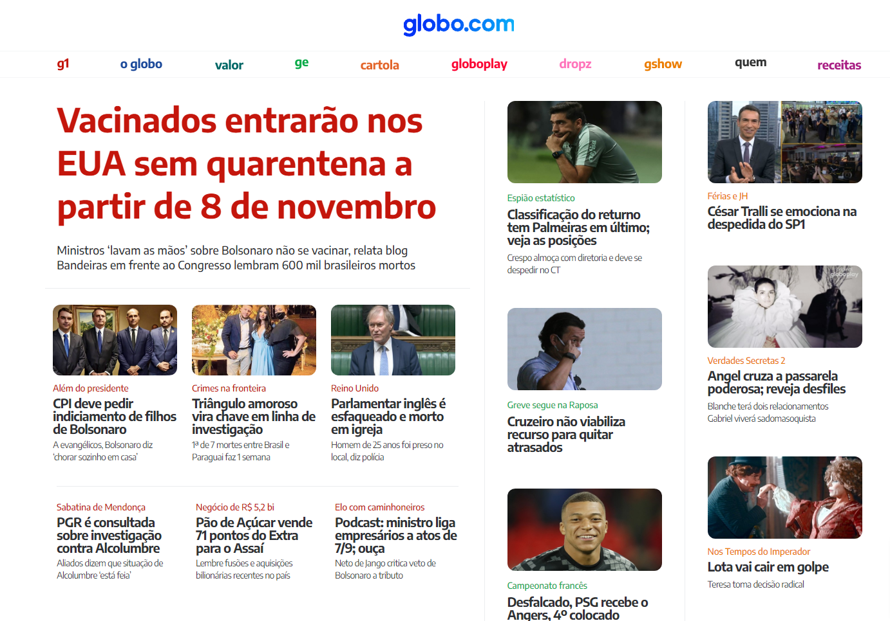

# projeto-globo

  
  
  <!--  -->
  
   
   
   
  
   
  
 

<h1 align="center">
    
</h1>

<h4 align="center"> 
	🚧 Globo.com 🚧
</h4>

	<!---->
	

 <a href="#-sobre-o-projeto">Sobre</a> •
 <a href="#-layout">Layout</a> • 
 <a href="#-como-executar-o-projeto">Como executar</a> • 
 <a href="#-tecnologias">Tecnologias</a> • 
 <a href="#-contribuidores">Contribuidores</a> • 
 <a href="#-autor">Autor</a> • 
 <a href="#user-content--licença">Licença</a>

## 💻 Sobre o projeto

📄 Projeto Globo - é um modelo recriado do site globo.com no intuito de estudar linguagens de marcação HTML, CSS, e alguns recursos de responsividade.

Projeto desenvolvido após assistir algumas aulas da **[Driven Education]** de [Desenvolvimento de Software].

A Driven Educatin é uma escola com cursos de tecnologia para todos os perfis, do iniciante ao avançado.

---

## 🎨 Layout

O layout da aplicação está disponível no Figma:

### Mobile

  

### Web

  

---

## 🛣️ Como executar o projeto

Basta copiar o link do projeto e clonar no repositório local, por fim, execute em seu navegador.

---

## 👨‍💻 Contribuidores

<table>
  <tr>
    <td align="center"><a href="https://github.com/jplimam"> <b>João Pedro Lima</b></a> 
  </tr>
</table>

## 💪 Como contribuir para o projeto

1. Faça um **fork** do projeto.
2. Crie uma nova branch com as suas alterações: `git checkout -b my-feature`
3. Salve as alterações e crie uma mensagem de commit contando o que você fez: `git commit -m "feature: My new feature"`
4. Envie as suas alterações: `git push origin my-feature`
> Caso tenha alguma dúvida confira este [guia de como contribuir no GitHub](./CONTRIBUTING.md)

---

## 🧙‍♂️ Autor

<a href="https://www.figma.com/@caiux">
 
  
 <b>Caio Lopes</b></a> <a href="https://www.figma.com/@caiux" title="Cubos Academy">✨</a>
  

---

## 📝 Licença

<!-- Este projeto esta sobe a licença [MIT](./LICENSE). -->

Feito com ❤️ por Caio Lopes 👋🏽 [Entre em contato!](https://www.linkedin.com/in/caiovslopes/)

